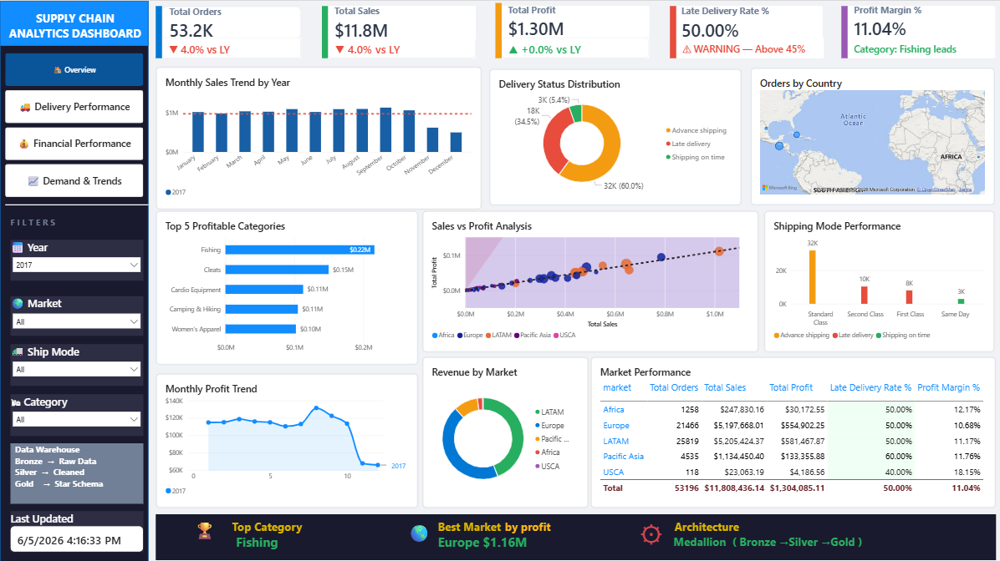
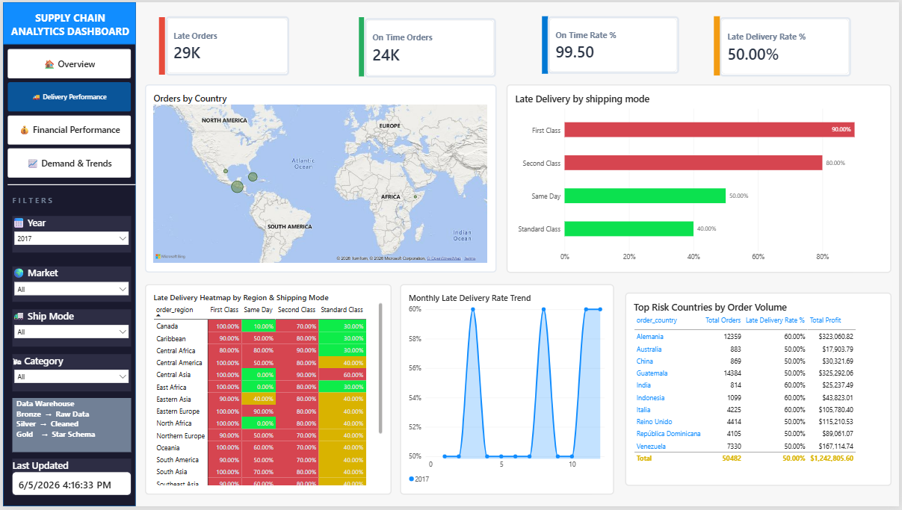
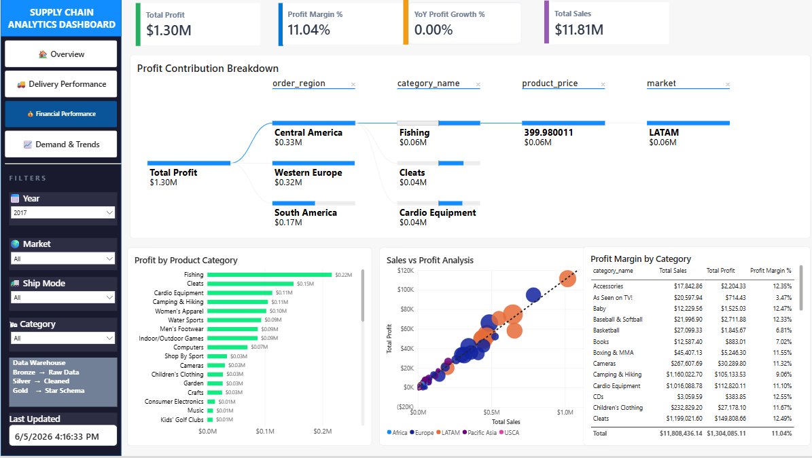
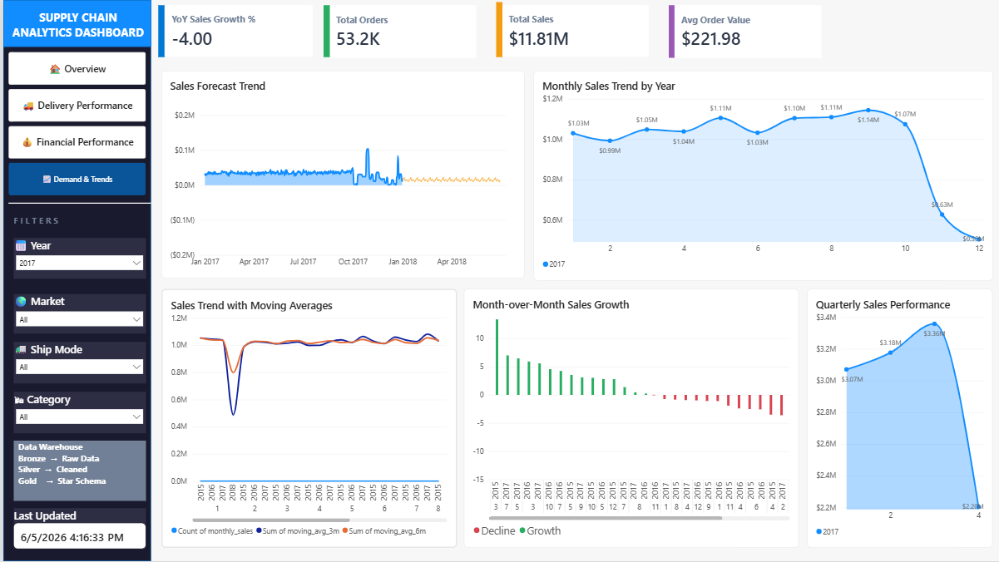

#  Supply Chain Analytics Dashboard
### End-to-End Data Warehouse Project | Medallion Architecture | Star Schema


---

##  Project Overview

End-to-end supply chain analytics project analyzing **180,519 real global orders**
across 5 international markets using a production-grade
**Medallion Architecture Data Warehouse** with full **Star Schema** design.

Built a complete data pipeline from raw CSV to an interactive
Power BI dashboard — using only **fact and dimension tables**
(no flat files in reporting layer).

---

##  Medallion Architecture

```
🥉 BRONZE LAYER
   └── Raw CSV ingestion
       DataCoSupplyChainDataset.csv
       180,519 rows | 53 columns

         ↓  Python ETL Pipeline

🥈 SILVER LAYER
   └── Cleaned & transformed data
       → Column standardization
       → Date parsing & validation
       → Null handling & deduplication
       → Feature engineering
         (is_late_delivery, profit_margin_pct,
          days_delayed, order_quarter, sales_segment)

         ↓  Star Schema Design

🥇 GOLD LAYER — Data Warehouse
   └── PostgreSQL Star Schema
       ├── fact_orders       (180,519 rows — measures + FK)
       ├── dim_customer      (customer info)
       ├── dim_product       (product + category)
       ├── dim_region        (country + market)
       ├── dim_shipping      (mode + delivery status)
       └── dim_date          (full date hierarchy)

         ↓  Power BI Direct Connection

📊 REPORTING LAYER
   └── Interactive Dashboard
       4-page Power BI report
       Connected to Gold layer only
```

---

## ⭐ Star Schema Design

```
                    dim_customer
                    (customer_key)
                          │
          dim_date ───────┤
          (date_key)      │
                          │
dim_product ────── fact_orders ────── dim_region
(product_key)    (FK + Measures)      (region_key)
                          │
                    dim_shipping
                    (shipping_key)
```

### Fact Table — fact_orders
```
Measures:
→ sales
→ order_profit_per_order
→ order_item_quantity
→ order_item_discount
→ is_late_delivery
→ days_delayed
→ profit_margin_pct

Foreign Keys:
→ customer_key  → dim_customer
→ product_key   → dim_product
→ region_key    → dim_region
→ shipping_key  → dim_shipping
→ date_key      → dim_date
```

---

##  Business Questions Answered

| # | Business Question | Answer |
|---|---|---|
| 1 | Which region has most delays? | Analyzed via dim_region + fact_orders |
| 2 | Most profitable product category? | Fishing consistently #1 |
| 3 | Late delivery rate by shipping mode? | Standard Class = highest late rate |
| 4 | Which country orders most? | Identified via world map analysis |
| 5 | Which market drives most profit? | Europe = $1.16M total profit |
| 6 | Peak order month? | December every year |

---

##  Dashboard Preview

### Page 1 — Executive Overview


**Features:**
- 5 KPI cards with YoY trend arrows
- Monthly Sales Trend by Year (2015–2018)
- Delivery Status Distribution donut
- World Map — Orders by Country
- Top 5 Profitable Categories
- Sales vs Profit scatter analysis
- Shipping Mode Performance
- Monthly Profit Trend
- Revenue by Market donut
- Market Performance summary table
- Key Insights banner (bottom)
- Medallion Architecture label

### Page 2 — Delivery Performance


- Late delivery rate by shipping mode
- Region vs shipping heatmap
- Monthly late rate trend
- Country delivery performance table
- 
### Page 3 — Financial Performance


- Decomposition tree (profit breakdown)
- Category profit analysis
- Profit margin by market
- Product performance ranking

### Page 4 — Demand & Trends


- Sales forecasting (6-month)
- Year-over-Year comparison
- 3M & 6M moving averages
- Quarterly trend analysis

---

## Key Business Insights

| Finding | Insight |
|---|---|
| 🚀 **Peak Month** | December = highest orders every single year |
| ⚠️ **Late Delivery** | ~50% of all orders face delivery delays |
| 💰 **Top Category** | Fishing generates highest total profit |
| 🌍 **Best Market** | Europe leads with $1.16M profit |
| 🚚 **Best Shipping** | Same Day has lowest late delivery rate |
| 📉 **Risk Products** | Several product lines show consistent losses |

---

## 🛠️ Tools & Technologies

| Tool | Purpose |
|---|---|
| Python (Pandas, NumPy) | Data cleaning & transformation |
| Matplotlib, Seaborn | Exploratory visualizations |
| PostgreSQL 16 | Data Warehouse storage |
| SQLAlchemy + psycopg2 | Python → PostgreSQL connection |
| Advanced SQL | 15 queries (CTEs, Window Functions) |
| ETL Pipeline | Medallion Architecture automation |
| Power BI Desktop | Interactive 4-page dashboard |
| DAX | 20+ custom measures & KPIs |

---

##  Advanced SQL Highlights

```sql
-- Q4: Detect delay spikes using LAG/LEAD + CASE WHEN
WITH monthly_delays AS (
    SELECT order_year, order_month,
        ROUND(AVG(is_late_delivery)*100, 2) AS late_rate_pct
    FROM fact_orders
    GROUP BY order_year, order_month
),
with_lag AS (
    SELECT *,
        LAG(late_rate_pct) OVER (
            ORDER BY order_year, order_month
        ) AS prev_month_late_rate
    FROM monthly_delays
)
SELECT *,
    CASE
        WHEN (late_rate_pct - prev_month_late_rate) > 5
            THEN '🔴 SPIKE DETECTED'
        WHEN (late_rate_pct - prev_month_late_rate) < -5
            THEN '🟢 IMPROVED'
        ELSE '🟡 Normal'
    END AS spike_flag
FROM with_lag
ORDER BY order_year, order_month;
```

### All SQL Techniques Used
```
✅ Window Functions  : RANK, DENSE_RANK, ROW_NUMBER, LAG, LEAD
✅ Multiple CTEs     : Up to 4 chained CTEs in one query
✅ PARTITION BY      : Across regions, markets, categories
✅ CASE WHEN         : Business logic and bucketing
✅ PERCENTILE_CONT   : P25, P50, P75, P90 distribution
✅ Running Totals    : Cumulative YTD sales
✅ Moving Averages   : 3-month and 6-month windows
✅ YoY Analysis      : Year-over-year growth calculations
✅ MoM Analysis      : Month-over-month growth tracking
✅ ROWS BETWEEN      : Custom window frame analysis
```

---

## 🔄 ETL Pipeline — Medallion Architecture

```python
def run_medallion_etl(file_path, engine):
    """
    🥉 BRONZE  → Extract raw CSV
    🥈 SILVER  → Transform & engineer features
    🥇 GOLD    → Load Star Schema to PostgreSQL
    """
    # Bronze: Extract
    df = pd.read_csv(file_path, encoding='latin-1')

    # Silver: Transform
    # → Clean columns, parse dates, handle nulls
    # → Engineer: is_late_delivery, profit_margin_pct,
    #             days_delayed, order_quarter

    # Gold: Load Star Schema
    # → dim_customer, dim_product, dim_region
    # → dim_shipping, dim_date
    # → fact_orders (with all foreign keys)
```

---

## 📈 DAX Measures (20+)

```
Basic   : Total Orders, Total Sales, Total Profit
          Late Orders, On Time Orders, Total Countries

Rates   : Late Delivery Rate %, On Time Rate %
          Profit Margin %, Avg Order Value

YoY     : Sales Last Year, YoY Sales Growth %
          Profit Last Year, YoY Profit Growth %
          (Using VAR CurrentYear approach)

Trends  : Sales Trend Label (▲/▼ with %)
          Profit Trend Label
          Orders Trend Label
          Late Rate Status Label
```

---

## 📁 Project Structure

```
project4-supply-chain/
│
├── DataCoSupplyChainDataset.csv         ← Raw dataset (Kaggle)
│
├── Project4_Supply_Chain_Analytics.ipynb ← Main notebook
│   ├── 🥉 Bronze Layer (EDA)
│   ├── 🥈 Silver Layer (ETL + Cleaning)
│   ├── 🥇 Gold Layer (Star Schema DW)
│   ├── 15 Advanced SQL Queries
│   └── Medallion ETL Pipeline
│
├── charts/
│   ├── chart1_delivery_status.png
│   ├── chart2_late_by_shipping.png
│   ├── chart3_category_profit.png
│   ├── chart4_top_countries.png
│   └── chart5_monthly_trend.png
│
├── powerbi_exports/
│   ├── powerbi_q1_regional_product_rank.csv
│   ├── powerbi_q2_cumulative_sales.csv
│   ├── powerbi_q3_late_regions_per_mode.csv
│   ├── powerbi_q4_delay_spikes.csv
│   ├── powerbi_q5_segment_profitability.csv
│   ├── powerbi_q7_mom_growth.csv
│   ├── powerbi_q8_market_dashboard.csv
│   ├── powerbi_q11_yoy_comparison.csv
│   ├── powerbi_q13_moving_averages.csv
│   └── powerbi_q15_executive_summary.csv
│
├── Supply_Chain_Dashboard.pbix          ← Power BI file
│
└── README.md                            ← This file
```

---

## ⚙️ How to Run

### Step 1 — Download Dataset
```
Kaggle → Search: "DataCo Supply Chain Dataset"
Download → DataCoSupplyChainDataset.csv
Place in project folder
```

### Step 2 — Install Libraries
```bash
pip install pandas numpy matplotlib seaborn sqlalchemy psycopg2-binary
```

### Step 3 — Setup PostgreSQL
```
Create database: supply_chain_dw
Update password in notebook Step 6:
'password': 'your_password_here'
```

### Step 4 — Run Notebook
```
Open Project4_Supply_Chain_Analytics.ipynb
Run all cells top to bottom
Bronze → Silver → Gold layers created automatically ✅
```

### Step 5 — Open Power BI
```
Get Data → PostgreSQL
Server   : localhost
Database : supply_chain_dw
Load tables:
→ fact_orders (main)
→ dim_customer, dim_product
→ dim_region, dim_shipping, dim_date

Create relationships in Model View
Build dashboard following guide
```

---

## 📊 Dataset

| Property | Value |
|---|---|
| Source | Kaggle — DataCo Global Supply Chain |
| Rows | 180,519 |
| Columns | 53 |
| Period | 2015 — 2018 |
| Markets | Europe, LATAM, Pacific Asia, USCA, Africa |
| Countries | 164 countries |

---

## 🎯 What Makes This Project Stand Out

```
✅ Production-grade Medallion Architecture
   (Bronze → Silver → Gold)

✅ True Star Schema Data Warehouse
   (Fact + 5 Dimension tables)
   No flat file in reporting layer!

✅ 15 Advanced SQL queries
   (CTEs, Window Functions, LAG/LEAD,
    PERCENTILE_CONT, ROWS BETWEEN)

✅ Automated ETL Pipeline
   (One function runs entire pipeline)

✅ 20+ DAX measures
   (YoY trends, KPIs, status labels)

✅ Industrial-level dashboard design
   (Sidebar navigation, insight banner,
    world map, decomposition tree)
```

---

## 🔗 Connect With Me

> Built as part of my Data Analytics Portfolio
>
> **Mohamed Arsath A**
> Data Analyst | Python | SQL | PostgreSQL | Power BI | ETL Pipeline
>
- LinkedIn: [Mohamed Arsath A](https://www.linkedin.com/in/mohamedarsath007)
- GitHub: [mohamedarsath1379](https://github.com/mohamedarsath1379)
---

*Dataset: Kaggle — DataCo Global Supply Chain Dataset*
*Architecture: Medallion (Bronze → Silver → Gold)*
*Database: PostgreSQL 16 | Star Schema Design*
